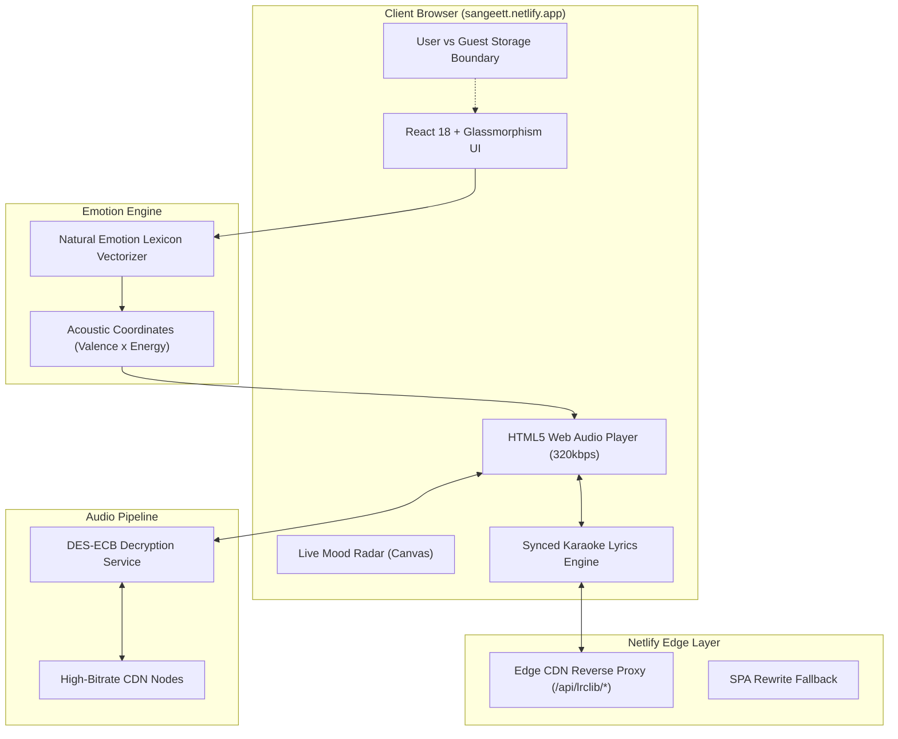

# 🎵 SANGEET — Dil Se Zuba Tak

<div align="center">

```
  ____                               _   
 / ___|  __ _ _ __   __ _  ___  ___| |_ 
 \___ \ / _` | '_ \ / _` |/ _ \/ _ \ __|
  ___) | (_| | | | | (_| |  __/  __/ |_ 
 |____/ \__,_|_| |_|\__, |\___|\___|\__|
                    |___/               
```

### *Where your emotions become soundwaves.*

[](https://sangeett.netlify.app/)
[](https://react.dev/)
[](https://vitejs.dev/)
[](https://www.python.org/)
[](https://sangeett.netlify.app/)
[](LICENSE)


---

</div>

<br/>

## 🌐 Live Production Deployment

Experience the full-fidelity web app live right now on any browser, mobile phone, tablet, or desktop:

👉 **[https://sangeett.netlify.app/](https://sangeett.netlify.app/)**

*Edge-accelerated via Netlify CDN with zero-CORS line-synced karaoke lyrics & high-bandwidth 320kbps streams.*

---

## ⚡ Superpowers

<table>
  <tr>
    <td width="50%">
      <h3>🧠 Emotional Vector Intelligence</h3>
      <p>Natural language sentiment parser that maps everyday expressions into high-dimensional acoustic target coordinates (<strong>Valence</strong>, <strong>Energy</strong>, <strong>Danceability</strong>, and <strong>Acousticness</strong>) accompanied by a live visual Mood Radar.</p>
    </td>
    <td width="50%">
      <h3>🎧 320 kbps Studio Fidelity</h3>
      <p>Real-time DES-ECB cipher decryption unwraps media streams directly from high-speed content delivery networks. Pristine studio clarity streamed straight into a custom HTML5 Web Audio engine.</p>
    </td>
  </tr>
  <tr>
    <td width="50%">
      <h3>🎤 Synced Karaoke Lyrics</h3>
      <p>Line-by-line real-time synchronized karaoke lyrics with dynamic smooth-scrolling and timestamp highlight. Powered by Netlify edge proxies and offline-first curated LRC line caches.</p>
    </td>
    <td width="50%">
      <h3>🔒 Multi-Tenant User & Guest Isolation</h3>
      <p>Seamless authentication with isolated account storage. Registered users keep their custom playlists and liked tracks permanently synced across devices, while guests enjoy complete privacy with isolated zero-trace temporary sessions.</p>
    </td>
  </tr>
  <tr>
    <td width="50%">
      <h3>🌌 10 Infinite Mood Rooms</h3>
      <p>Immersive thematic chambers (<em>Broken Heart, Rainy Night, Lo-Fi Focus, Gym Beast, Sufi Soul, Bollywood Retro</em>) dynamically expandable on-demand into endless tracks per room.</p>
    </td>
    <td width="50%">
      <h3>📱 Fluid Glassmorphism Design</h3>
      <p>Responsive interface engineered with curated obsidian & ember glassmorphism aesthetics, dynamic interactive vinyl animations, and tactile touch controls tailored for every screen size.</p>
    </td>
  </tr>
</table>

---

## 🥊 Sangeet vs. Legacy Streaming Platforms

| Feature | Legacy Apps (Spotify, JioSaavn) | 🎵 Sangeet |
| :--- | :---: | :---: |
| **Audio Bitrate** | 128 kbps (Free) / 320 kbps (Paid) | **320 kbps Direct High-Fidelity (Free)** |
| **Advertisements** | Audio & Visual Ad Interruptions | **100% Ad-Free Pure Flow** |
| **Search By Feeling** | Rigid keywords & genre tags | **Conversational NLP Emotional Vectoring** |
| **Guest / Incognito Play** | Requires mandatory sign-up | **Zero-Friction Guest Mode with Ephemeral Isolation** |
| **Synchronized Lyrics** | Often paywalled or missing | **Full Real-Time Karaoke Engine Included** |
| **Custom Mix Creation** | Heavy bloat & algorithmic injection | **Instant One-Click Reorder & Personal Mixes** |

---

## 🏗️ Under The Hood

Sangeet combines a client-side resilient fallback engine with an asynchronous Flask microservice architecture to achieve **100% continuous uptime** on both local environments and edge cloud providers:



---

## 🛠️ The Tech Arsenal

- **Frontend Core**: [React 18](https://react.dev/), [Vite](https://vitejs.dev/), ES Modules
- **Styling Architecture**: Custom Glassmorphism Token Engine, TailwindCSS, Inter & Outfit Typography
- **Audio & Lyrics**: HTML5 Web Audio API, LRCLIB Line Sync, Custom LRC Parser
- **Backend Services**: Python 3.10+, Flask REST API, PyCryptodome (DES-ECB Cipher)
- **Data Persistence**: MongoDB (PyMongo) with Thread-Safe JSON Store Fallback & User-Scoped Client Isolation
- **Edge Deployment**: Netlify Edge CDN Proxy with automated GitHub continuous delivery

---

## 💻 Quick Start

Clone and run the complete ecosystem locally in less than 60 seconds:

### Prerequisites
- [Node.js](https://nodejs.org/) (v18+)
- [Python](https://python.org/) (v3.10+)

### 1. Clone the Repository
```bash
git clone https://github.com/techprem324/sangeet.git
cd sangeet
```

### 2. Install Dependencies
```bash
# Install frontend packages
npm --prefix frontend install

# Install backend Python packages
pip install -r backend/requirements.txt
```

### 3. Launch with One Command
```bash
npm start
```

> **Windows Users**: You can also double-click [`start.bat`](file:///d:/song/start.bat) or run `.\start.ps1` in PowerShell.

- 🌐 **Frontend UI**: [http://localhost:5173](http://localhost:5173) (or [http://localhost:5000](http://localhost:5000))
- ⚙️ **Flask REST API**: [http://localhost:5000/api](http://localhost:5000/api)
- 🩺 **Health Check**: [http://localhost:5000/api/health](http://localhost:5000/api/health)

---

## 📡 API Endpoint Overview

| Method | Route | Description |
| :--- | :--- | :--- |
| `POST` | `/api/chat` | Transforms conversational mood prompt into emotion vectors + 320kbps tracks |
| `POST` | `/api/mood` | Real-time sentiment analysis returning valence, energy, and genre affinities |
| `GET` | `/api/lyrics` | Returns synchronized karaoke lines `[{ t, text }]` for the active track |
| `GET` | `/api/catalog` | Retrieves curated mood room collections |
| `POST` | `/api/explore` | Expands category tracks dynamically up to 500+ songs |
| `GET` | `/api/search` | Fast instant search across global Bollywood, Indie, and International tracks |
| `GET` / `POST` | `/api/playlists` | User-isolated playlist creation, retrieval, and track management |
| `GET` / `POST` | `/api/liked` | User-isolated hearted song library |
| `POST` | `/api/auth/login` | Authenticates registered user sessions |
| `POST` | `/api/auth/register` | Registers new user account with isolated library |

---

## 👨‍💻 Author & Vision

Crafted with ❤️ and obsession for music by **Prem Srivastava** ([@techprem324](https://github.com/techprem324)).

> *"Music shouldn't be trapped behind paywalls, subscription tiers, or impersonal algorithms. It should speak the language of what you feel right now."*

---

<div align="center">

**[⚡ Visit Live Web App: https://sangeett.netlify.app/](https://sangeett.netlify.app/)**

⭐ Star this repository if Sangeet hit the right chord with you!

</div>
